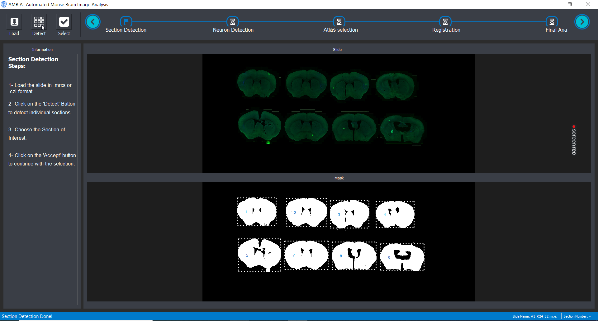
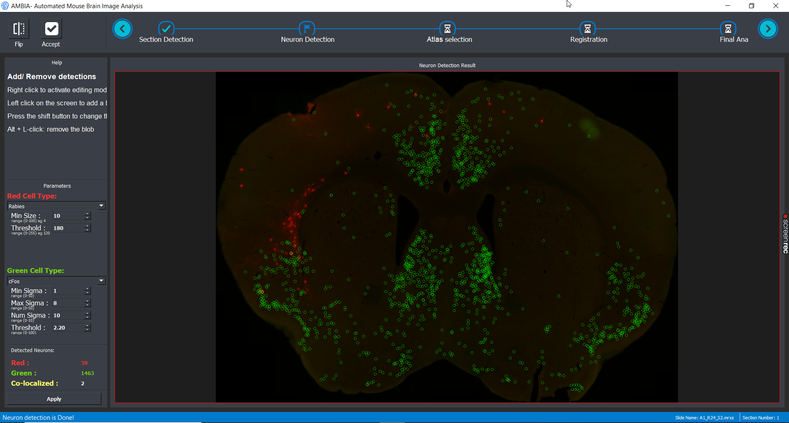
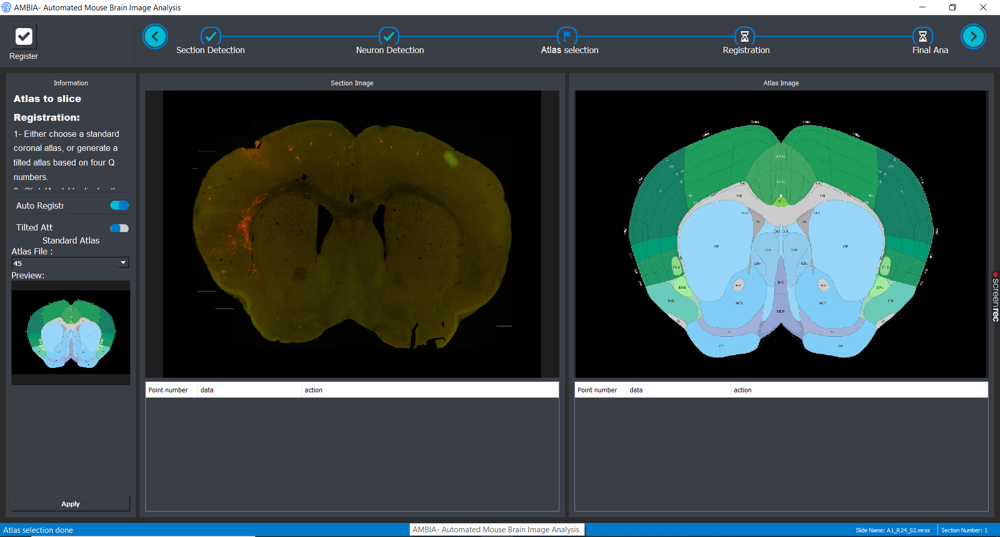
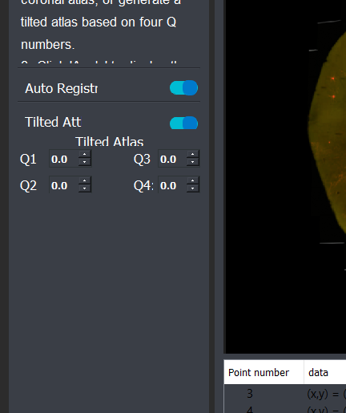
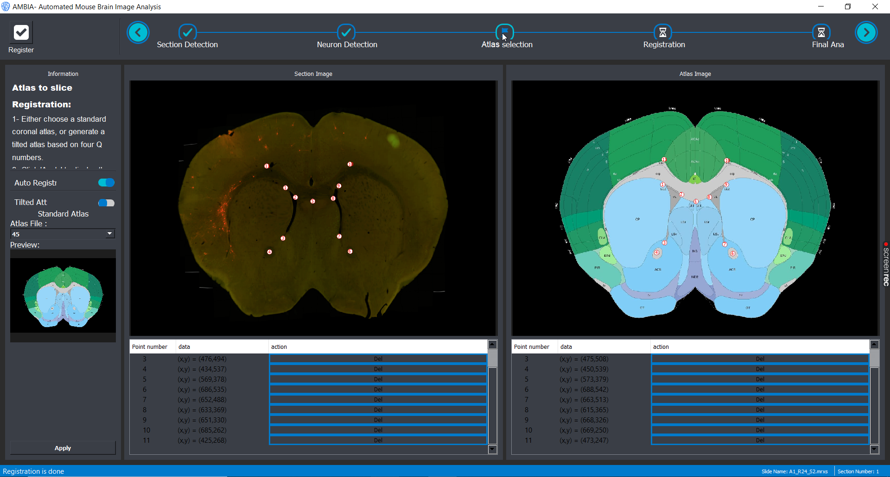
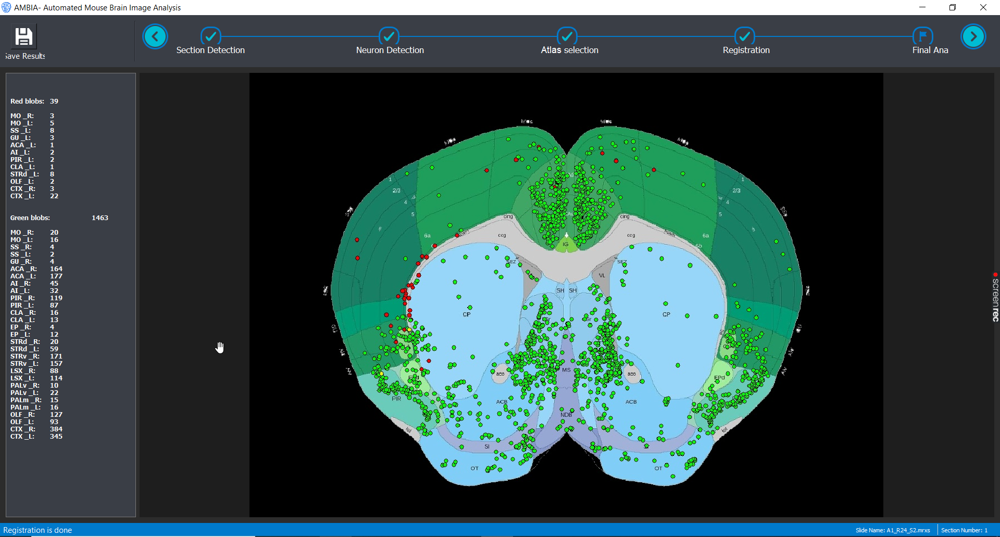

# AMBIA

AMBIA (**A**ccurate **M**ouse **B**rain **I**mage **A**nalysis) is a tool to fascilitate the analysis of 2D histological Mouse brain images. It is written purely in python and has a modular design and consists of the following modules:
- Cell detection Module
- Localization Module
- Atlas generator module
- Registration Module

## Requirements

AMBIA is intentionally designed with few requirements. You can easily run AMBIA on your local computer. Ofcourse computers with higher ram and stronger CPUs make AMBIA run faster. Following a the requirements before you install AMBIA:
- Python > 3.7

## Installation

1. Install python, ideally version 3.7.9, on your system. 
2. Download AMBIA package files from this Git repository \
or you can use \
`Git clone https://github.com/mrymsadeghi/AMBIA.git` 
3. Use the requirements.txt file provided in the package to install the necessary python packages with optimal versions \
`pip install -r requirements.txt`
4. Run the Main.py file to run AMBIA

## Structure of files and folders
The files and folders in the AMBIA Git repository consists of the following folers:
- Gui Atlases
- Ambia_core
- models
- Processed \
Keep this folder structure in your system for AMBIA to work correctly. \
Here is an explanation of the content and functionality of each folder:
#### Gui Atlases folder
This folder contains the color coded coronal atlases of adult mouse brain or P56 mouse brain. In the file `Static_Switches.py` if you choose `atlas_type = Adult`, AMBIA will use Adult atlases in this folder. Also it is noteworthy that the color codes of each atlas is contained in the folder `Ambia_core/src/atlas_codes`.
#### Ambia_core folder
This folder contains all the python code for the Cell detection, Localization, Atlas generator and Registration Module, as well as the GUI. The file `Ambia_core/src/Switches_Static.py` contatins parameters that are editable by the users. Parameters such as for choosing the atlas type (`atlas_type`), turning auto registration on or off (`auto_registration`) and etc. 
#### models folder
This folder contains three different type of data
- Deep learning trained models for the localization module. Including the SL predictor, QL predictor, Group A segmentation modes
- Excel sheet templates in which Ambia exports data
- Files required for generating tilted 2D allen mouse brain atlas from the 3D atlas in the Allen_files folder
#### Processed folder
This is where the files and reports of the analysis of your mouse brain slices will be saved. Also as an example, we provide analysis of two mouse brain slices from two different slides are in this folder.

## GUI screenshots
Here are some screenshots of AMBIA GUI showing different stages of analysis with a mrxs format slide image. \
**Loading the Slide image** \
Slide image is loaded. AMBIA detects different mouse brain slices, and now the user can choose which slice to analyse. \
 \
**Cell Detection** \
Different methods can be implemented in the cell detection module. Here as default two methods for each channel is provided. The user can choose between methods for each of the green and red channels and parameters can be adjusted in the GUI \
 \
**Localization** \
The selected slice can now be registered to a mouse brain atlas. The user can either choose a standard coronal allen atlas based on its number. Or by toggling the "Tilted atlas" switch in the GUI, you can use the deep learning localization module to detect the position of the slice and generate a custom atlas. \
 \
 

**Registration** \
After choosing or generating an atlas, you can toggle auto registration switch on to perform automatic ardent registration. And later choose landmarks to refine the registration. \
 \
**Analysis Report** \
AMBIA demostrates visually where the detected cells are located in the registered mouse brain slice on the annotated atlas. Also a report is generated in the form of an Excel sheet and a text file which reports the number of detected cells in each brain region.

## Video Tutorial
You can find video tutorials on how to install and use AMBIA in the following links: 

[Installation and how to start](https://www.example.com) \
[How to Use AMBIA](https://www.example.com) \
[How to modify the code of AMBIA](https://www.example.com) 

## Publication
Link of publications for AMBIA: \
https://link.springer.com/article/10.1007/s12021-023-09632-8 \
https://www.spiedigitallibrary.org/conference-proceedings-of-spie/12032/2604231/Automatic-2D-to-3D-localization-of-histological-mouse-brain-sections/10.1117/12.2604231.short?SSO=1 \
https://www.researchgate.net/publication/359719171_Automatic_2D_to_3D_localization_of_histological_mouse_brain_sections_in_the_reference_atlas_using_deep_learning

## Other resources
Development of AMBIA on Gitlab since 2020 [here](https://gitlab.com/maryams88/mb_gui)

Ardent package Github [here](https://github.com/neurodata/ardent)
